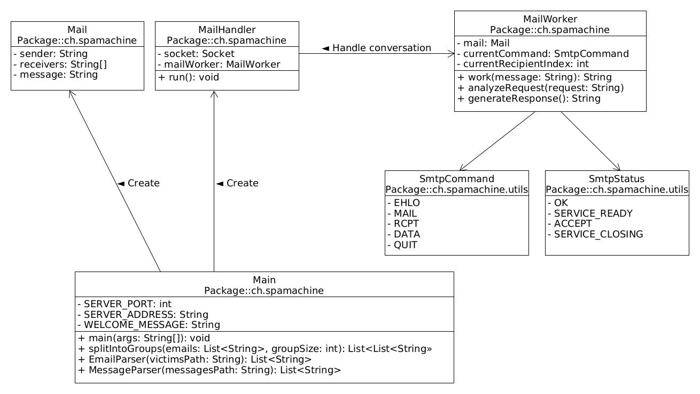
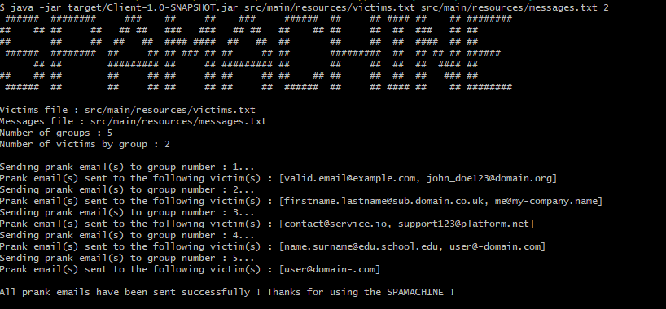
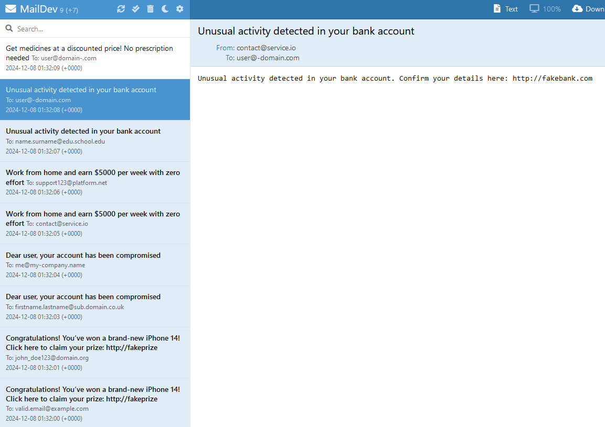

# DAI Lab4 : SMTP


```bash
 ######  ########     ###    ##     ##    ###     ######  ##     ## #### ##    ## ######## 
##    ## ##     ##   ## ##   ###   ###   ## ##   ##    ## ##     ##  ##  ###   ## ##       
##       ##     ##  ##   ##  #### ####  ##   ##  ##       ##     ##  ##  ####  ## ##       
 ######  ########  ##     ## ## ### ## ##     ## ##       #########  ##  ## ## ## ######   
      ## ##        ######### ##     ## ######### ##       ##     ##  ##  ##  #### ##       
##    ## ##        ##     ## ##     ## ##     ## ##    ## ##     ##  ##  ##   ### ##       
 ######  ##        ##     ## ##     ## ##     ##  ######  ##     ## #### ##    ## ########
 ```

---

 ## Description

SPAMACHINE is a Java client application designed to send prank emails to groups of victims. It uses a fake SMTP server (MailDev) to simulate email sending to victims and prank messages are loaded from input files.


## Setup the lab environment

First init the docker compose file

[MailDev](https://github.com/maildev/maildev) is a fake SMTP server for testing emails. Pull its Docker image using:

```bash
docker pull maildev/maildev:latest
```

Init the docker compose file

```bash
docker compose up -d
```

You can build the project with [Maven](https://maven.apache.org/index.html) using the pom.xml file
```bash
mvn -f Client/pom.xml clean package
```

You can run the SPAMACHINE with the following command:

```bash
java -jar Client/target/Client-1.0-SNAPSHOT.jar <victimFile> <messageFile> <groupCount>
```

---

## Input File Structures and Validation

To run the SPAMACHINE correctly, you need two input files:

- A victim email file (.txt)
- A prank message file (.txt)

These files must follow specific formats to ensure the program processes them correctly.

### 1. Victim Email File (victims.txt)

The victim file contains a list of email addresses, with each email address on a separate line.

#### Requirements:
- Only valid email addresses are accepted (validated with regex).
- Invalid or improperly formatted email addresses will be ignored.
- Can have blank lines between

#### Example Structure:
```bash
john.doe@example.com 
jane_doe123@domain.org 

user@sub.domain.co.uk 
admin@company.io 
contact@service.com
```

### 2. Prank Message File (messages.txt)

The message file contains the messages to be sent as emails. 

#### Requirements:
- Email subject and body must be on the same line.
- Can have blank lines between

#### Example Structure:
Congratulations! You’ve won a brand-new iPhone 14! Click here to claim your prize: http://fakeprize.com

Dear user, your account has been compromised. Verify your details immediately via this link: http://phishing-link.com

Work from home and earn $5000 per week with zero effort. Sign up now!
Unusual activity detected in your bank account. Confirm your details here: http://fakebank.com

## Implementation

The program is divided into several modules, each responsible for specific tasks:

### Main
- Entry point of the program.
- Reads input files, processes arguments and initializes the email-sending process.

### MailHandler
- Manages communication with the SMTP server.
- Sends commands and reads responses from the server.

### MailWorker
- Handles SMTP protocol logic.
- Ensures proper sequencing of commands like EHLO, MAIL, RCPT, etc.

### Mail
- Represents an email with sender, recipients, and message content.

### Enums SmtpCommand and SmtpStatus
- Define the commands and expected server responses for the SMTP protocol.





## How It Works

### Reading Input
- Victim emails and prank messages are read from files and validated.
- Victims are grouped based on the specified number of groups.

### SMTP Communication
- The program connects to the MailDev SMTP server (via localhost:1025).
- Commands are sent sequentially (EHLO, MAIL, RCPT, DATA, etc.) to send each prank email.

### Error Handling
- If an unexpected server response is received, the program attempts to exit with a QUIT command.


## Program Output

### Program Demo Output


In the screenshot above, the program sends prank emails to 5 groups of victims. We choosed to have groups of 2 victims but as we only have 9 victims, the last group has only one victim (handled by the program). The program sends a prank email to each victim, with the sender displayed being a random victim from the entire list.

### MailDev Web Interface Output


In the screenshot above, the MailDev web interface shows the prank emails received by the victims. Each email is displayed with the sender, recipient, and message content. The email content is a random prank message from the input file.

### Empty File Handling


In the screenshot above, the program handles an empty victim file by displaying an error message and exiting.